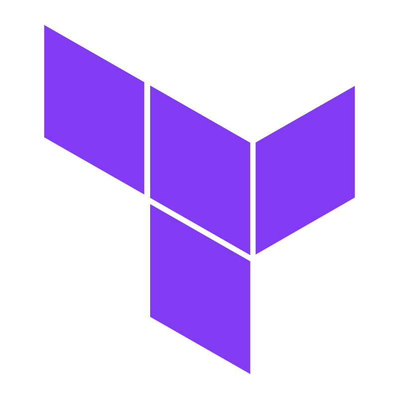
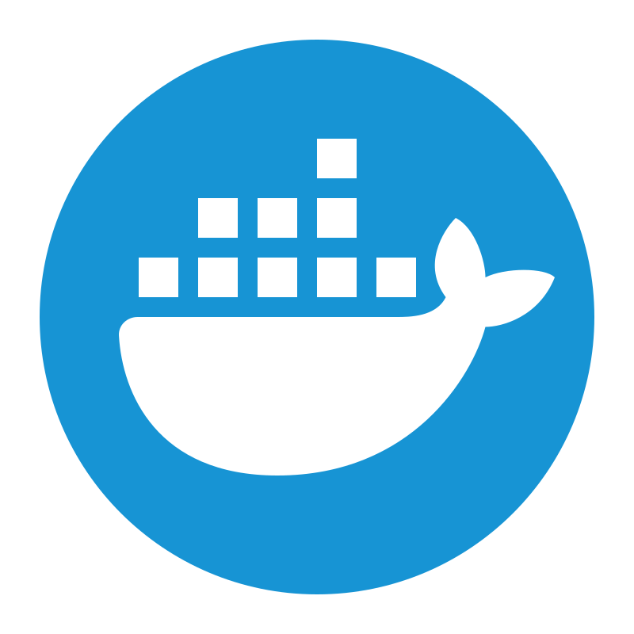
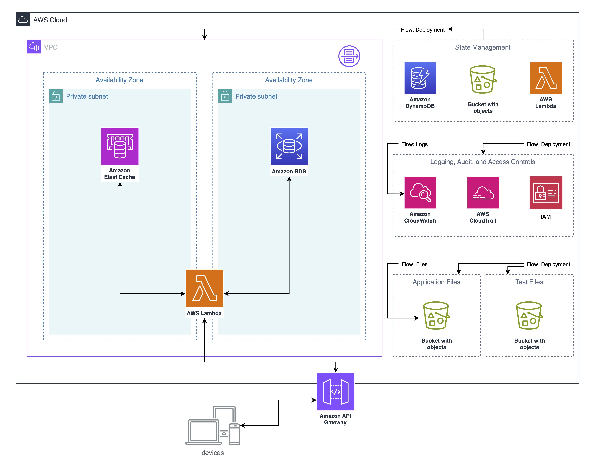
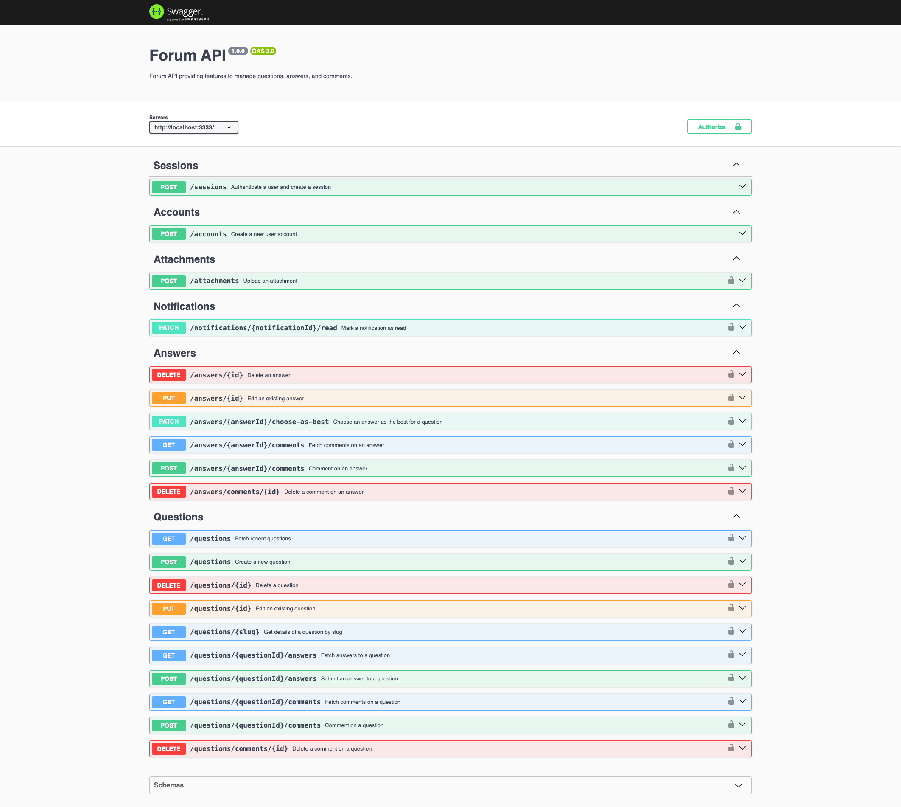
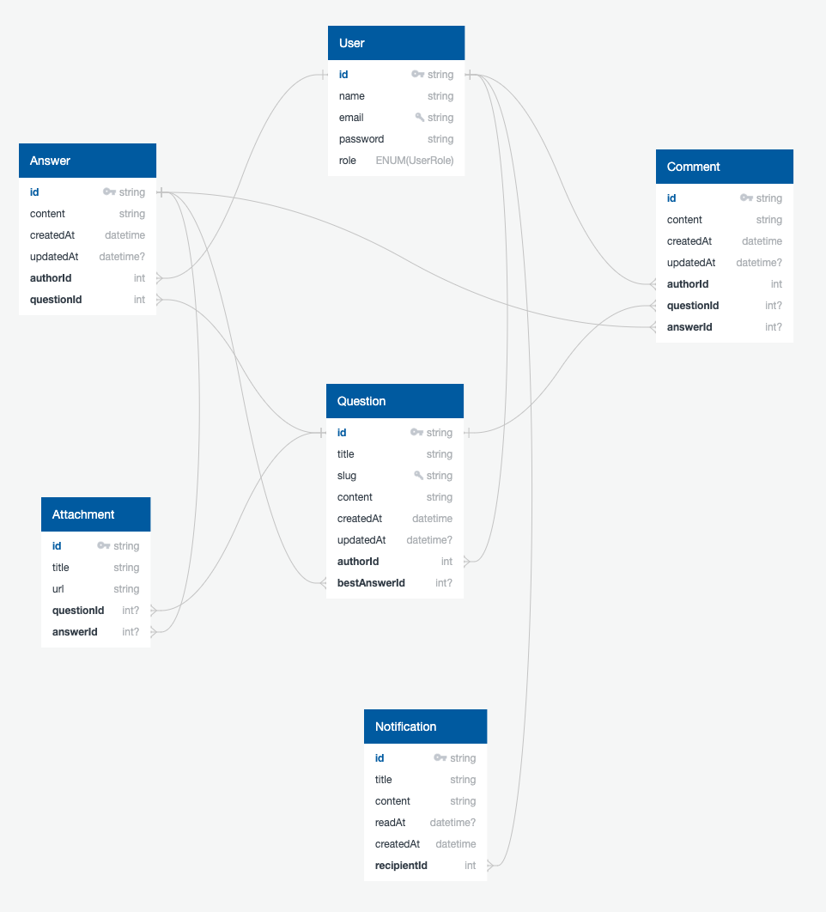

# forum api

<p float="left">
   &nbsp;
   &nbsp;
   &nbsp;
   &nbsp;
   &nbsp;
   &nbsp;
   &nbsp;
   
</p>

## 📃 Overview
This project is a RESTful API designed for forum management. The use cases are centered around the fundamental elements of __questions__, __answers__, and __comments__. The entire application is built following SOLID principles, clean architecture, and domain event patterns.

## ☁️ Infrastructure


## ⚙️ Services


## 🧱 ERM


## ▶️ Getting started

**Requirements**
- [Node.js - Official Node.js® download page](https://nodejs.org/en/download)
- [Docker Engine - Official Docker installation guide](https://docs.docker.com/engine/install)
- [AWS CLI - Official AWS CLI installation page](https://docs.aws.amazon.com/cli/latest/userguide/getting-started-install.html)
- [Terraform - Official Terraform installation guide](https://developer.hashicorp.com/terraform/tutorials/aws-get-started/install-cli)

**Clone the project**
```bash
$ git clone https://github.com/wladimirgrf/forum.git && cd forum
```

**Install the Project dependencies**
```bash
$ npm install
```

**Environment Variables**
```bash
$ cp .env.example .env
```

**Set access credentials**
```bash
aws configure
```

## 🖥️ Local Environment

**Run the containers**
```bash
$ docker-compose up -d
```

**Migrations**
```bash
$ npm run db:migrate
```

**Launch the Application**
```bash
$ npm run start:dev
```
>[!NOTE]
>The API will be launched at `http://localhost:3333/` <br>
>Documentation available at `http://localhost:3333/docs`

## 🚀 Deployment
You need to set up the resources for Terraform state synchronization.

**Create the Bucket**
```bash
aws s3api create-bucket --bucket forum-tf-state --region us-east-1
```

>[!CAUTION]
>S3 requires unique names for buckets.

**Create the DynamoDB table for state lock**
```bash
aws dynamodb create-table \
    --table-name forum-tf-state-lock \
    --attribute-definitions AttributeName=LockID,AttributeType=S \
    --key-schema AttributeName=LockID,KeyType=HASH \
    --provisioned-throughput ReadCapacityUnits=1,WriteCapacityUnits=1 \
    --region us-east-1
```

**Initialize the Working Directory**
```bash
npm run infra:prep
```

**Check the Execution Plan (_OPTIONAL_)**
```bash
npm run infra:plan
```

**Deploy the entire Infrastructure**
```bash
# The process takes about 10 minutes
npm run infra:up
```

>[!NOTE]
>Terraform requires a username and password for database access during deployment to securely connect the application.

## △ Prisma
__Prisma migrations are automatically executed during deployment.__

However, a point of attention is that this project uses private VPC and that Prisma does not support (_in the current version_) the execution of migrations via API. 

In this case, I downloaded the engine of the current version that I am using into the project's deployment flow, and with a simple JS script, it is possible to use Lambda to execute the migrations within the VPC.

>[!IMPORTANT]
>So, if you want to run this project or another with the same structure, you need to pay attention to the engine version. Below is the link with the step-by-step guide to download the schema engine for the version of Prisma you are using:
> https://github.com/prisma/prisma/discussions/14873

Another link that is interesting to follow is the issue that addresses this topic in the Prisma repository. This feature may eventually be supported by the framework.
https://github.com/prisma/prisma/issues/4703

## 🤝 Contributing

**Fork the repository and clone your fork**

```bash
$ git clone <fork-url> && cd forum
```

**Create a branch for your edits**
```bash
$ git checkout -b new-feature
```

**Make the commit with your changes**
```bash
$ git commit -m 'feat: New feature'
```

**Send the code to your remote branch**
```bash
$ git push origin new-feature
```

Create a pull request with your version. <br>
After your pull request is merged, you can delete your branch.


## 📝 License

This project is licensed under the MIT License - see the [LICENSE](LICENSE) file for details.