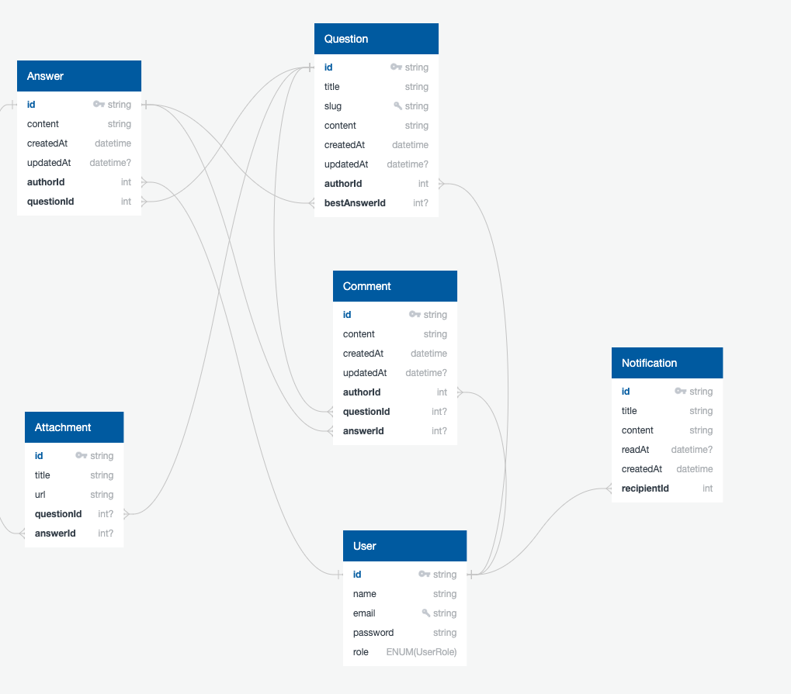

# forum api

   &nbsp;
   &nbsp;
   &nbsp;
   &nbsp;
   &nbsp;
   &nbsp;
   &nbsp;
   

## 📃 Overview
This project is a RESTful API designed for forum management. The use cases are centered around the fundamental elements of __questions__, __answers__, and __comments__. The entire application is built following SOLID principles, clean architecture, and domain event patterns.

## ⚙️ Services

## 🧱 ERM
 