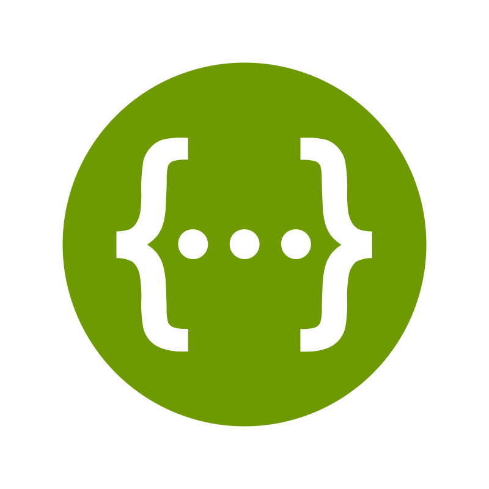

# forum api

<p float="left">
   &nbsp;
   &nbsp;
   &nbsp;
   &nbsp;
   &nbsp;
   &nbsp;
   &nbsp;
   
</p>

## 📃 Overview
This project is a RESTful API designed for forum management. The use cases are centered around the fundamental elements of __questions__, __answers__, and __comments__. The entire application is built following SOLID principles, clean architecture, and domain event patterns.


## ⚙️ Services


## 🧱 ERM


## ▶️ Getting started

**Requirements**

- 🔰 [https://nodejs.org/en/](https://nodejs.org/en/)
- 🐳 [https://docs.docker.com/compose/install/](https://docs.docker.com/compose/install/)
- 🌏 [https://developer.hashicorp.com/terraform/tutorials/aws-get-started/install-cli](https://developer.hashicorp.com/terraform/tutorials/aws-get-started/install-cli)

**Clone the project**
```bash
$ git clone https://github.com/wladimirgrf/forum.git && cd forum
```

**Install the Project dependencies**
```bash
$ npm install
```

**Environment configuration**
```bash
# Make a copy of '.env.example'
# Fill both files with YOUR environment variables.
$ cp .env.example .env
$ cp .env.example .env.test
```

**Run the containers**
```bash
$ docker-compose up -d
```

**Migrations**
```bash
$ npm run db:migrate
```

**Launch the Application**
```bash
$ npm run start:dev
```
>[!NOTE]
>The API will be launched at `http://localhost:3333/` <br>
>Documentation available at `http://localhost:3333/docs`
